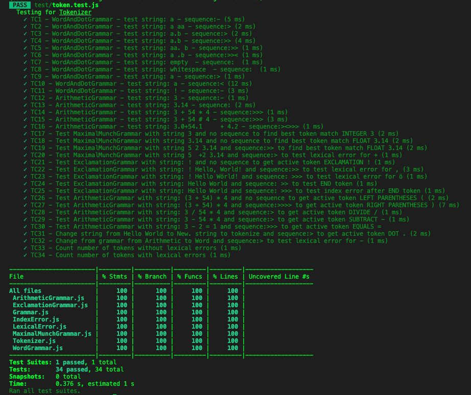

# Mall för inlämning laboration 1, 1dv610

## Checklista
  - [x] I min tokeniserare finns inga tokentyper eller reg-exp. Dessa finns i mitt testprojekt eftersom de skapas utav användaren.
  - [x] Jag har skrivit all kod och reflektioner själv. Jag har inte använt mig av andras kod för att lösa uppgiften.
  - [x] Mina testresultat är skrivna utifrån utförd testning ( och inte teoretiskt, det bör fungera :) )
  - [x] De enda statiska metoder eller funktioner utanför klasser som jag har är för att starta upp min testapplikation ex main(java).
  - [x] De enda bibliotek och färdiga klasser som används är sådana som måste användas (eller som används för att testa modulen).

## Egenskattning och mål
  - [ ] Jag är inte klar eftersom jag vet att jag saknar något. Då skall du inte lämna in!
  - [ ] Jag eftersträvar med denna inlämning godkänt betyg (E-D)
    - [ ] De flesta testfall fungerar
    - [ ] Koden är förberedd på Återanvändning
    - [ ] All kod samt historik finns i git 
    - [ ] Kodkvaliterskraven är ifyllda
    - [ ] Reflektion är skriven
  - [] Jag eftersträvar med denna inlämning högre betyg (C-B) och anser mig uppfylla alla extra krav för detta. 
    - [ ] Samtliga testfall är skrivna
    - [ ] Egna testfall för Maximal munch och kantfall
    - [ ] Testfall är automatiserade
    - [ ] Det finns en tydlig beskrivning i hur modulen skall användas (i git)
    - [ ] Kodkvalitetskraven är varierade 
  - [x] Jag eftersträvar med denna inlämning högsta betyg (A) 

Förtydligande: Examinator kommer sätta betyg oberoende på vad ni anser. 

## Återanvändning    
Instruktioner finns i [README.md](./README.md) med komplett exempel längst ner, eller på [npm](https://www.npmjs.com/package/@david-heineback/tokenizer)

## Beskrivning av min kod
### Classes:
- Tokenizer: 
  - **Svenska:** **Tokenizer** är en klass som tar emot en grammatik och en sträng som argument och håller sedan metoder för att se aktiv token och stega sig fram och tillbaka genom en array av tokens.  
  - **English:** **Tokenizer** is a class that takes a grammar and a string as arguments and provides methods to see active token and step through array of tokens.    
- Grammar:
  - **Svenska:** Skapa din egen grammatik genom att antingen använda "new Grammar" och sedan använda metoden setRegexExpressionsWithTypes för att sätta grammatiken eller skapa en helt egen klass genom att "extenda" Grammar klassen och lägg till dina reguljära uttryck som objekt i arrayen this.#regexWithTypes. Se exempel i [README.md](./README.md)  

  - **English** Create your own grammar by either create a new Grammar and use the setRegexExpressionsWithTypes or create your own class by extending the Grammar class and adding regex with tokenType and regex as a object to the this.#regexWithTypes array. See examples in [README.md](./README.md)
   

### Methods:
Hämta aktiv token  
Get the token att current index.

    getActiveToken()
    Svenska:  Returnerar aktiv token som ett object med tokentyp, reguljärt uttryck och tokenvärdet. Kastar lexikalt fel om man försöker hämta en token på ett index som innehåller en token med lexikalt fel.  

    English: returns the currently active token as object with token type, regex used to match and token value. Throw Error: Throws a LexicalError if trying to access a index that contains a token with a lexical error

Sätt aktiv token till nästa index  
Set the active token to the next index.

    setActiveTokenToNext()  
    Svenska: Kastar lexikalt fel om man försöker hämta en token på ett index som innehåller en token med lexikalt fel. Kastar indexfel om man försöker sätta aktiv token till ett värde efter END token.   
    English: Throws a LexicalError if trying to access a index that contains a token with a lexical error. Throws a IndexError if trying to access a index after END token.

Sätt aktiv token till förgående index.  
Set the active token to the previous index.

    setActiveTokenToPrevious()
    Svenska: Kastar indexfel om man försöker sätta index till ett värde mindre än 0.
    English: Throws a IndexError if trying to access a index before index 0.

### Återanvänd skapat Tokenizer objekt:
### Reuse same Tokenizer object:

Sätt en ny sträng att tokenizera.  
Set a new string to tokenize by passing a new string.

    token.setNewStringToTokenize('New string to tokenize')

Sätt en ny lexikal grammatik att använda genom att skicka med en ny grammatik och vilken sträng som ska tokenizeras med den nya grammatiken.  
Set a new lexical grammar to use to tokenize by passing a new grammar and a new string to use with  the new lexical grammar.

    setNewLexicalGrammar(arithmeticGrammar, 'String to tokenize')

Räkna antalet tokens som tokenizerats. (Inkluderar eventuell token med lexicalt fel!)  
Count number of tokens. (Will include count of invalid token!)

    countTokens()

## Hur jag testat
Automatiska testfall är skrivna med hjälp av testramverket Jest.  
Samtliga testfall finns i filen **./test/token.test.js** och kan köras med kommandot **npm test**. 

### Testfall
Lista de enskilda testfallen. **Fetmarkera** sådant som du själv fyllt i. En rad per testfall.  

  

| Namn      | Grammatik | Sträng | Sekvens | Förväntat Aktivt Token | PASS/FAIL |
| --------- | --------- | ------ | ------- | ------------ | --------- |
| TC1 | WordAndDotGrammar  | a | [] | WORD(a) | PASS |
| TC2 | WordAndDotGrammar  | a aa | [>] | WORD(aa) | PASS |
| TC3 | WordAndDotGrammar  | a.b | [>] | DOT(.)  | PASS |
| TC4 | WordAndDotGrammar  | a.b | [>>] | **WORD(b)**  | PASS |
| TC5 | WordAndDotGrammar  | aa. b | **[>>]** | WORD(b)  | PASS |
| TC6 | WordAndDotGrammar  |  a .b  | [>><] | DOT(.) | PASS |
| TC7 | WordAndDotGrammar  |  empty string | [] | END(END)  | PASS |
| TC8 | WordAndDotGrammar  | only a ws    | [] | **END(END)**  | PASS |
| TC9 | WordAndDotGrammar  |  a      | **[>]** | END(END)  | PASS |
| TC10 | WordAndDotGrammar  |  a      | [<] | **Throws index error** | PASS |
| TC11 | WordAndDotGrammar  |  !      | [] | Throws lexical error | PASS |
| TC12 | ArithmeticGrammar  |  3      | [] | NUMBER(3)  | PASS |
| TC13 | ArithmeticGrammar  |  3.14   | [] | NUMBER(3.14)  | PASS |
| TC14 | ArithmeticGrammar  |  3 + 54 * 4 | [>>>] | MULTIPLY(*)  | PASS |
| TC15 | ArithmeticGrammar  |  3 + 54 # 4 | [>>>] | Throws lexical error  | PASS |
| TC16 | ArithmeticGrammar  |  3.0+54.1     + 4.2   | [><>>>] | ADD(+)  | PASS |

### Testfall för högre betyg

Lista de enskilda testfallen. En rad per testfall.
| Namn      | Grammatik | Sträng | Sekvens | Förväntat Aktivt Token | PASS/FAIL |
| --------- | --------- | ------ | ------- | ------------ | --------- |
| TC17 | MaximalMunchGrammar  | 3 | [] | INTEGER(3) | PASS |
| TC18 | MaximalMunchGrammar  | 3.14| [] | FLOAT(3.14) | PASS |
| TC19 | MaximalMunchGrammar  | 5 2 3.14 | [>>] | FLOAT(3.14)  | PASS |
| TC20 | MaximalMunchGrammar  | 5  +2 3.14 | [>] | Throws lexical error  | PASS |
| TC21 | ExclamationGrammar  | ! | [] | EXCLAMATION(!)  | PASS |
| TC22 | ExclamationGrammar  |  ! Hello, World! | [>>] | Throws lexical error | PASS |
| TC23 | ExclamationGrammar  |  ! Hello Wörld! | [>>>] | Throws lexical error  | PASS |
| TC24 | ExclamationGrammar | Hello World   | [>>] | END(END)  | PASS |
| TC25 | ExclamationGrammar  | Hello World  | [>>>] | Throws index error | PASS |
| TC26 | ArithmeticGrammar | (3 + 54) * 4   | [] | LEFT PARENTHESES(() | PASS |
| TC27 | ArithmeticGrammar  |  (3 + 54) * 4     | [>>>>] | RIGHT PARENTHESES())| PASS |
| TC28 | ArithmeticGrammar  |  3 / 54 * 4     | [>] | DIVIDE(/)  | PASS |
| TC29 | ArithmeticGrammar  |  3 - 54 * 4  | [>] | SUBTRACT(-)  | PASS |
| TC30 | ArithmeticGrammar  | 3 - 2 = 1 | [>>>] | EQUALS(=)  | PASS |
| TC31 - Change string from Hello World to New. string to tokenize | WordAndDotGrammar  |  Hello World /  New. string to tokenize   | [>] | DOT(.)| PASS |
| TC32 - Change from grammar from Arithmetic to Word | ArithmeticGrammar / WordAndDotGrammar   |  3 - 2 = 1 | [>] | Throws lexical error | PASS |
| TC33 - Count number of tokens without errors | ExclamationGrammar  |  No Errors!  | [] | 3  | PASS |
| TC34 - Count number of tokens with lexical errors | ExclamationGrammar  | Somewhere is a .Error! | [] | 4  | PASS |
  

## Kodkvalitetskrav

### Namngivning

| Namn och förklaring | Reflektion |
| ------------------  | ---------- |
| **Tokenizer**   Namn på Klass   |  Detta klassnamn bockar av flera av de rubriker som tas upp i boken.  Det finns ingen förkortning eller någonting annat i programmet som har ett liknande namn **(Avoid Disinformation)**. Det är också lätt att **uttala namnet / (Use Pronounceable Names)**    Klassens namn är ett **substantiv** vilket rekommenderas för klasser och beskriver klassens syfte bra **(Use Intention-Revealing Names)**, . Eventuellt skulle man kunna döpa den till StringTokenizer för att förtydliga att det är strängar som tokeniseras. |
| **WordGrammar**   Namn på Klass | Detta klassnamn kan i viss mån ses som att det ger användaren disinformation **(Avoid disinformation)** då den faktiskt kan hantera både ord och punkter.            |
| **Tokenizer.getActiveToken**   Metod på Tokenizer klassen.    |    Metoden är en **"verb-fras"** som använder sig av "standard" **prefixet** **get**.. för att visa att metoden hämtar något   |
| **Tokenizer.setActiveTokenToNext**   **Tokenizer.setActiveTokenToPrevious**   Metoder på Tokenizer klassen.    |   Även dessa använder sig aven **"verb-fras"** med **prefix** fast i detta fallet används **set** för att visa att det är ett värde som sätts om metoden körs.         |
| **Tokenizer.countTokens**   Metod på Tokenizer klassen. |          Även om detta namnet är en **"verb-fras"** kanske namnet bör ses över, vilka tokens är det som räknas. Inkluderar det eventuell token med lexicalt fel? räknas End token? **(Use Intention-Revealing Names)**  |
| **IndexError**   Extends error. |  Skulle kunna heta något med Exception för att förtydliga för den programmerare som använder vår tokenizer att detta är något som vi förväntar oss att denna ska hantera. |

### Funktioner

| Namn och förklaring | Antal rader | Reflektion |
| ------------------- | ----------- | ---------- |
| **#addBestTokenMatch()**: Privat metod i Tokenizer klassen som kontrollerar en token mot bästa matching av token typ | 10       |  **Blocks and indenting** I detta avsnitt diskuteras storleken på kod inom exempelvis en if/else-sats och att den bör endast vara en rad annars ska man fundera över om blocket borde kalla på en funktion. I detta fallet har jag valt att inte göra det eftersom att if blocket innehåller tre rader kod och else blocket fyra rader. Anledningen är att jag vill undvika en "explosion" av metoder och else blocket kan man egentligen se som en rad som pushar in ett objekt i en array och eftersom att objektet innehåller tre key/value par så vill jag lägga dessa på varsin egen rad för att gör koden mer lättläst.   **Do one thing** Metoden kollar efter bästa tokenmatchning och lägger till detta i arrayen av tokens. Det man skulle kunna argumentera för är att jag även lägger till lexical-fel om ingen token hittas men jag anser att bästa matchningen då är att ingen token hittats och har därför valt att ha de i samma metod som ett if/else - statement     |
| **#matchStringWithRegex()**:  Privat metod i Tokenizer som matchar en sträng mot angiven lexicalgrammatik och lägger till tokens i en array | 5      |  **Don’t Repeat Yourself** - Metoden ittererar genom alla de olika typer av lexicala grammatiker som finns för grammtik som användaren angett och försöker matcha med den nuvurande strängen.   **Blocks and Indenting** Även här finns en if-sats med ett block om fyra rader där man egentligen kan se det som en rad men då objektet innehåller tre key/value par så blir det tydligare att lägga de på varsin rad.     **Do One Thing** - Kontrollerar en sträng mot samtliga lexicala grammatiker och lägger till matchande tokens i en array. |
| **#createTokens()**:  Privat metod i Tokenizer klassen som loopar igenom strängen som användaren angett och skapar tokens | 5      | **Reading Code from Top to Bottom: The Stepdown Rule** Denna klassen skapar alla tokens genom att ta strängen som angetts och bryta ner till tokens genom att kalla de två metoderna som nämnts tidigare i tabellen i en sekvens.   **Have No Side Effects** Även att denna metod kallar på två andra metoder så anser jag att det inte skapas några sideffekter. Metoden ska skapa tokens och för att göra detta behöver vi matcha strängen mot en grammatik och sedan kontrollera efter bästa token matchning för att kunna skapa en token.   **Blocks and indenting** Man skulle kunna ändra koden så att det bara skapas en token vid varje tillfälle man ber om en aktiv token. Detta är en fördel om vi får in en väldig lång sträng i vår kod då vi slipper skapa en token förrens den är aktuell. Däremot när jag gjorde på detta sättet så blev det en harang av if/else uttryck som var beroende av att komma i en viss ordning och jag valde därför att istället plocka ut samtliga tokens på en och samma gång.   |
| **getActiveToken()** metod i Tokenizer klassen som returnerar en aktiv token | 5       | **Switch Statements** - Jag hade en plan på att använda en switch sats i denna metod för att avgöra om jag ska returenera ett END objekt eller en aktiv token men eftersom boken avråder från detta då de av sin natur blir långa så valde jag istället att köra med if/else.   **Reading Code from Top to Bottom: The Stepdown Rule** - Metoden kallar först på en metod för att kontrollera att aktiv token är "valid" och returnerar sedan aktiv token eller ett END objekt.    |
| **setActiveTokenToNext()**: Sets the active token to the next index | 5           | **Error Handling Is One Thing** - Jag har skapat egna klasser för att hantera fel. I denna metod kastas ett undantag (IndexError) om man försöker stega sig förbi END token.   **Command Query Separation** Denna metoden sätter endast index för aktiv Token till nuvarande index plus ett eller kastar ett fel om index blir större än längden på array med tokens. Jag skickade till en början tillbaka den nya aktiva token direkt när användaren exekverade denna metod men eftersom att detta avsnitt säger att metoden ska antingen göra något ett besvara något, inte båda så valde jag att ta bort returen av aktiv token och använder får istället kalla på getActiveToken() efter att denna metod körts för att få ut data på ny aktiv token. Däremot så kontrollerar jag i denna metoden om det index man stegar till innehåller ett lexikalt fel och jag kastar då direkt ett undantag vilket man också skulle kunna flytta och endast ha på getActiveToken(). Men jag gör på detta sättet eftersom att lexikala fel ligger sist i arrayen av tokens och användaren ska inte kunna stega sig vidare eller få detta som aktivt token |

## Laborationsreflektion  
Jag valde att skapa en Tokenizer som direkt vid skapandet delar upp hela strängen i tokens. Jag testade även att lägga till så att en token endast skapas när man ber om den som aktiv men eftersom att koden då blev beroende av flera olika if/else satser så valde jag att tokenisera allt på en gång.  
Jag testade även att skicka med 40.000 lorem ipsum ord och punkter för att jämföra prestandan på de två olika alterantiven och det var inget som var märkbart.  
Gällande namngivning försökte jag direkt att följa de riktlinjer/rubriker som tas upp i Clean Code. Utöver "regex" finns ingen metod eller klassnamn som innehåller förkortningar eller liknanade namn för olika saker (**Avoid Disinformation**).  
Jag har försökt undvika noice words, det man skulle kunna fundera över klassnamen för de olika grammatikerna som samtliga heter **PrefixGrammar** t.ex. WordGrammar och ArithmeticGrammar men det är olika grammatiker (**Make Meaningful Distinctions**).  
Det ska i koden inte finnas några enstaviga ord eller variabler. Jag undviker iteratorer som kräver att det deklareas en variabel bara för att hålla koll på iterationen nuvarande index (**Use searchable names**).  
Jag använder långa och förklarande namn och försöker undervika förkortningar. Som tidigare nämts skulle man kunna se regex som en förkortningen men jag har så långt som möjligt försökt att undvika att ha det med i några publika metoder och den enda som innehåller det är metoden som används för att sätta regex på en ny Grammar som skapas av användaren (**Avoid Mental Mapping** ).  
Inga metoder använder sentimentala namn eller namn som ska anses vara "skojiga" (**Don’t Be Cute**).  
 Genom att följa de punkter som tas upp i kapitel två om namgiving uppfyller metoder **Use Descriptive Names** som diskuteras i kapitel 3 om funktioner. 
Metoder som börjar med # är syntax för privata metoder i javascript.  
Det finns två metoder som är **monadic** och en **dyadic**, i övrigt är metoderna **niladic**.  
Setter metoden på Grammar klassen tar en sträng som parameter och sedan finns det två metoder som jag har lagt in på Tokenizer klassen för att kunna återanvända samma Tokenizer objekt flera gånger utan att skapa en ny Tokenizer. setNewStringToTokenize som endast tar en ny sträng som argument och sedan setNewLexicalGrammar som tar en ny grammatik och en sträng som parameter.  
På metoden för att sätta ny grammatik valde jag mellan att ha två parametrar **dyadic** och att ha en parameter **monadic** och att användaren då även får köra metoden för att sätta en ny sträng om denna metoden ska fungera korrekt men i just detta fallet kändes det mest användarvänligt att göra det i samma metod då strängen inte behöver vara en ny utan kan vara samma som man tidigare tokenizerat med en annan grammatik.  
Parametrarna på dessa metoder ska varken kontrolleras som boolska värden eller förändras i sig **(Common Monadic Forms)** och de ska heller inte ses som ett **Output Argument** då det är en input till vad som förändras på Tokenizer objektet och metoderna returnerar inte något till användaren.
Metoderna är små och samtliga är mindre än de 20 rader som boken menar att man ska försöka hålla sig under (**Small**).
